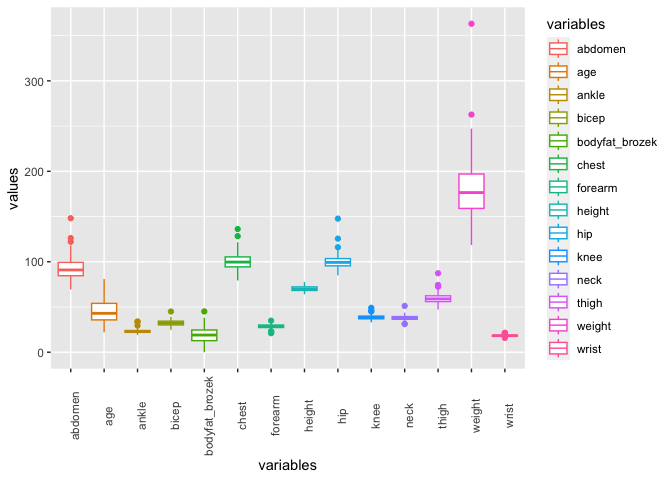
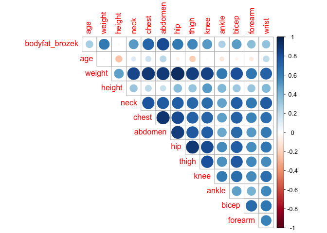
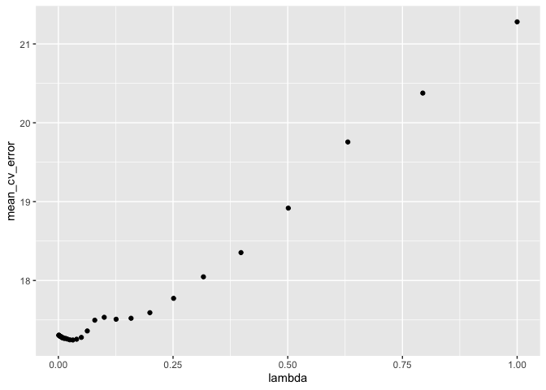
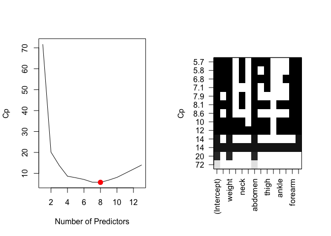
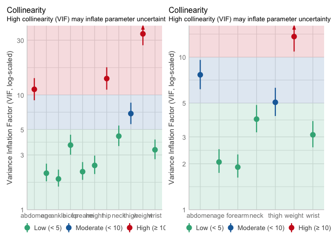
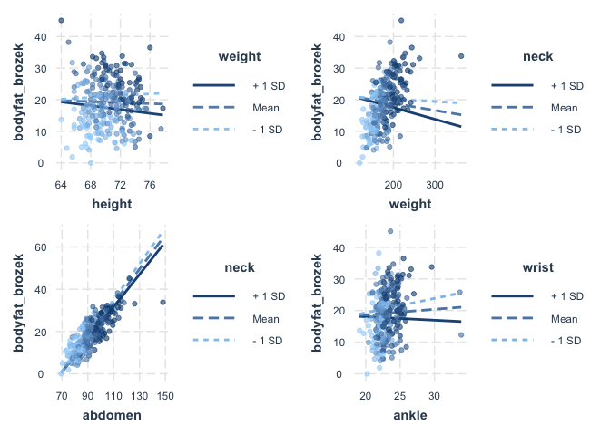
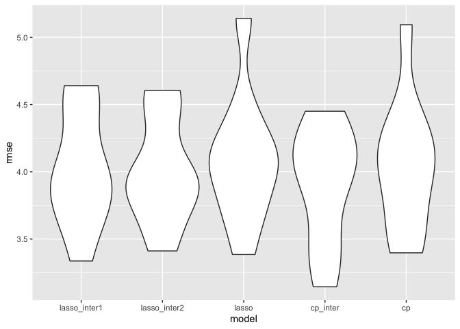

model_assumption
================
Xicheng Xie
2022-12-10

## Abstract

While body fat has been an important predictor in the medical field, the
measurement of body fat could sometimes be quite challenging. Therefore,
the goal of this study was to build a regression model that could help
predict the Brozek’s percent body fat by using variables that are much
easier to measure. Variables were selected based on two main
approaches: 1) criterion-based methods that involved the use of Mallow’s
$C_p$ and Akaike information criterion (AIC); 2) shrinkage techniques
that involved lasso, ridge, and elastic net regression. The predictive
accuracy of these candidate models were compared and the model with the
lowest Root Mean Squared Error was selected as final model. The features
included in the final proposed model include age, weight, the
circumferences of the neck, thigh, forearm, wrist, abdomen, an
interaction term between abdomen and neck, and a second interaction term
between weight and abdomen. All assumptions for a multiple linear
regression model are checked during model diagnostics. While the model
provided a good approximation to Brozek’s body fat, it may not be
applicable to other measures of body fat. Meanwhile, a standardized
measurement protocol for each of these predictors is necessary to reduce
measurement bias.

## Introduction

Body fat has long been an important predictor in many health and medical
situations: its role as an indicator of a healthy lifestyle, as a
potential risk factor for cardiovascular disease, or as an indicator for
obesity, etc. Despite its wide use in medical practices, the measurement
of body fat could sometimes be quite challenging. Hence, the goal of
this study is to build a regression model that could help us predict the
body fat by using variables that are much easier to measure.

The raw dataset we were given contained 252 rows and 14 columns. We
utilized percent body fat measured using Brozek’s equation
(bodyfat_brozek) as our response variable because some studies have
shown that it is a relatively [more accurate
alternative](https://pubmed.ncbi.nlm.nih.gov/21085903/) compared to
Siri’s equation. The dataset also contained information on the subjects’
age in years, weight (lbs), measured circumferences of chest, hip, neck
and various other body parts in centimeters.

## Methods

### Data exploration: descriptive statistics and visualization

We used the data set which has measurements of 252 men and contains
different variables: the outcome, `bodyfat_brozek`, and potential
predictors including `age`, `weight`, `height`, `neck`, `chest`,
`abdomen`, `hip`, `thigh`, `knee`, `ankle`, `bicep`, `forearm`, `wrist`.
To ensure the stability of our model, we calculated descriptive
statistics for each variable of our study population. The distributions
of each variable were studied to consider potential transformations (if
necessary). Meanwhile, we discovered if there are any missing values or
unusual observations which might be considered as potential
outliers/influential points. Furthermore, we discovered the correlations
among all the variables to inspect potential multicollinearity.

### Construction of Model

1.  Variable selection

Best subset selection was employed as an alternative to identify the
best model. Generally speaking, it is a method that involves finding the
subset of predictors that best predict the response variable by
considering all the possible combinations of explanatory variables.
After that, the “best” model with only one predictor would be
identified, and then the one with 2 predictors, and so on. We applied
several methods to employ our predictor selection. Several statistical
methods have been proposed to explore potential effects in epidemiologic
studies. In our model-building part, we mainly applied criterion-based
procedures, including Mallow’s $C_p$ criterion and Akaike Information
Criterion (AIC), LASSO, Ridge regression, and ENET to penalize the
number of predictors.

While there are many criterion for finding the “best” model, such as
maximizing adjusted $R^2$, or minimizing Mean Squared Error (MSE), we
chose Mallow’s $C_p$ and AIC as our “gold-standard”. Mallow’s $C_p$
compares the predictive ability of the subset model to the full model,
by measuring the bias. We then chose the model with a $C_p$ statistic
smaller than or equal to the number of predictors in the subset model.
If a number of models meet that condition, the model with the smallest
$C_p$ is chosen. We didn’t choose Bayesian information criterion (BIC)
because it has a severe penalization for models with a larger number of
predictors. AIC is an estimator of prediction error and thereby relative
quality of statistical models for a given set of data. It rewards
goodness of fit (as assessed by the likelihood function), but it also
includes a penalty that is an increasing function of the number of
estimated parameters. LASSO, proposed by Tibshirani, shrinks
coefficients towards exact zeroes, and thus promises to be a useful tool
for variable selection. However, with highly correlated variables as
predictors, LASSO tends to select only one out of these correlated
variables and ignore the others. Ridge regression, as another shrinkage
regression method, , which in turn improves prediction accuracy by
minimizing the ridge loss function (mean squared error plus a penalty
term). However, ridge regression does not perform variable selection
because it cannot shrink coefficient estimates exactly to zero. ENET is
a hybrid penalized regression method that blends LASSO and ridge
regression to overcome the limitation of LASSO on data with highly
correlated variables. Similar to LASSO, ENET executes variable
selection, but it also has the ability to select a group of non-zero
collinear variables.

2.  Interaction

After predictor selection, we further probe the interaction between the
predictors. Generally, the third and higher-order interactions are weak
and hard to interpret, we first looked at the main effects and
second-order interactions to find whether there are any significant
parts of interaction terms between variables. For significant
interaction terms, a versatile and sometimes the most interpretable
method for understanding interaction effects is plotting. Package
`interactions` provides `interact_plot` as a relatively pain-free method
to get good lot-looking plots using `ggplot2` on the backend.

3.  Model comparison and diagnosis

At last, we applied 10-fold cross-validation to decide which candidate
`best` model has better performance in predicting by calculating and
comparing their root-mean-square error (RMSE) in the `test` part. RMSE
is a frequently used measure of the differences between values (sample
or population values) predicted by a model. Afterward, a model diagnosis
was performed. we used several diagnostics for checking the adequacy of
our final regression model, including checking model assumption,
identifying outliers and influential points, and multicollinearity
inspection.

## Results

### Study population characteristics

Characteristics of the study population overall were summarized in the
table below. Participants had a mean age of 44.88 years and a standard
deviation (SD) of 12.60 years. The average outcome is 18.94% of body fat
with a SD of 7.75.

<div id="gwtedogvmb" style="padding-left:0px;padding-right:0px;padding-top:10px;padding-bottom:10px;overflow-x:auto;overflow-y:auto;width:auto;height:auto;">
<style>html {
  font-family: -apple-system, BlinkMacSystemFont, 'Segoe UI', Roboto, Oxygen, Ubuntu, Cantarell, 'Helvetica Neue', 'Fira Sans', 'Droid Sans', Arial, sans-serif;
}

#gwtedogvmb .gt_table {
  display: table;
  border-collapse: collapse;
  margin-left: auto;
  margin-right: auto;
  color: #333333;
  font-size: 16px;
  font-weight: normal;
  font-style: normal;
  background-color: #FFFFFF;
  width: auto;
  border-top-style: solid;
  border-top-width: 2px;
  border-top-color: #A8A8A8;
  border-right-style: none;
  border-right-width: 2px;
  border-right-color: #D3D3D3;
  border-bottom-style: solid;
  border-bottom-width: 2px;
  border-bottom-color: #A8A8A8;
  border-left-style: none;
  border-left-width: 2px;
  border-left-color: #D3D3D3;
}

#gwtedogvmb .gt_heading {
  background-color: #FFFFFF;
  text-align: center;
  border-bottom-color: #FFFFFF;
  border-left-style: none;
  border-left-width: 1px;
  border-left-color: #D3D3D3;
  border-right-style: none;
  border-right-width: 1px;
  border-right-color: #D3D3D3;
}

#gwtedogvmb .gt_caption {
  padding-top: 4px;
  padding-bottom: 4px;
}

#gwtedogvmb .gt_title {
  color: #333333;
  font-size: 125%;
  font-weight: initial;
  padding-top: 4px;
  padding-bottom: 4px;
  padding-left: 5px;
  padding-right: 5px;
  border-bottom-color: #FFFFFF;
  border-bottom-width: 0;
}

#gwtedogvmb .gt_subtitle {
  color: #333333;
  font-size: 85%;
  font-weight: initial;
  padding-top: 0;
  padding-bottom: 6px;
  padding-left: 5px;
  padding-right: 5px;
  border-top-color: #FFFFFF;
  border-top-width: 0;
}

#gwtedogvmb .gt_bottom_border {
  border-bottom-style: solid;
  border-bottom-width: 2px;
  border-bottom-color: #D3D3D3;
}

#gwtedogvmb .gt_col_headings {
  border-top-style: solid;
  border-top-width: 2px;
  border-top-color: #D3D3D3;
  border-bottom-style: solid;
  border-bottom-width: 2px;
  border-bottom-color: #D3D3D3;
  border-left-style: none;
  border-left-width: 1px;
  border-left-color: #D3D3D3;
  border-right-style: none;
  border-right-width: 1px;
  border-right-color: #D3D3D3;
}

#gwtedogvmb .gt_col_heading {
  color: #333333;
  background-color: #FFFFFF;
  font-size: 100%;
  font-weight: normal;
  text-transform: inherit;
  border-left-style: none;
  border-left-width: 1px;
  border-left-color: #D3D3D3;
  border-right-style: none;
  border-right-width: 1px;
  border-right-color: #D3D3D3;
  vertical-align: bottom;
  padding-top: 5px;
  padding-bottom: 6px;
  padding-left: 5px;
  padding-right: 5px;
  overflow-x: hidden;
}

#gwtedogvmb .gt_column_spanner_outer {
  color: #333333;
  background-color: #FFFFFF;
  font-size: 100%;
  font-weight: normal;
  text-transform: inherit;
  padding-top: 0;
  padding-bottom: 0;
  padding-left: 4px;
  padding-right: 4px;
}

#gwtedogvmb .gt_column_spanner_outer:first-child {
  padding-left: 0;
}

#gwtedogvmb .gt_column_spanner_outer:last-child {
  padding-right: 0;
}

#gwtedogvmb .gt_column_spanner {
  border-bottom-style: solid;
  border-bottom-width: 2px;
  border-bottom-color: #D3D3D3;
  vertical-align: bottom;
  padding-top: 5px;
  padding-bottom: 5px;
  overflow-x: hidden;
  display: inline-block;
  width: 100%;
}

#gwtedogvmb .gt_group_heading {
  padding-top: 8px;
  padding-bottom: 8px;
  padding-left: 5px;
  padding-right: 5px;
  color: #333333;
  background-color: #FFFFFF;
  font-size: 100%;
  font-weight: initial;
  text-transform: inherit;
  border-top-style: solid;
  border-top-width: 2px;
  border-top-color: #D3D3D3;
  border-bottom-style: solid;
  border-bottom-width: 2px;
  border-bottom-color: #D3D3D3;
  border-left-style: none;
  border-left-width: 1px;
  border-left-color: #D3D3D3;
  border-right-style: none;
  border-right-width: 1px;
  border-right-color: #D3D3D3;
  vertical-align: middle;
  text-align: left;
}

#gwtedogvmb .gt_empty_group_heading {
  padding: 0.5px;
  color: #333333;
  background-color: #FFFFFF;
  font-size: 100%;
  font-weight: initial;
  border-top-style: solid;
  border-top-width: 2px;
  border-top-color: #D3D3D3;
  border-bottom-style: solid;
  border-bottom-width: 2px;
  border-bottom-color: #D3D3D3;
  vertical-align: middle;
}

#gwtedogvmb .gt_from_md > :first-child {
  margin-top: 0;
}

#gwtedogvmb .gt_from_md > :last-child {
  margin-bottom: 0;
}

#gwtedogvmb .gt_row {
  padding-top: 8px;
  padding-bottom: 8px;
  padding-left: 5px;
  padding-right: 5px;
  margin: 10px;
  border-top-style: solid;
  border-top-width: 1px;
  border-top-color: #D3D3D3;
  border-left-style: none;
  border-left-width: 1px;
  border-left-color: #D3D3D3;
  border-right-style: none;
  border-right-width: 1px;
  border-right-color: #D3D3D3;
  vertical-align: middle;
  overflow-x: hidden;
}

#gwtedogvmb .gt_stub {
  color: #333333;
  background-color: #FFFFFF;
  font-size: 100%;
  font-weight: initial;
  text-transform: inherit;
  border-right-style: solid;
  border-right-width: 2px;
  border-right-color: #D3D3D3;
  padding-left: 5px;
  padding-right: 5px;
}

#gwtedogvmb .gt_stub_row_group {
  color: #333333;
  background-color: #FFFFFF;
  font-size: 100%;
  font-weight: initial;
  text-transform: inherit;
  border-right-style: solid;
  border-right-width: 2px;
  border-right-color: #D3D3D3;
  padding-left: 5px;
  padding-right: 5px;
  vertical-align: top;
}

#gwtedogvmb .gt_row_group_first td {
  border-top-width: 2px;
}

#gwtedogvmb .gt_summary_row {
  color: #333333;
  background-color: #FFFFFF;
  text-transform: inherit;
  padding-top: 8px;
  padding-bottom: 8px;
  padding-left: 5px;
  padding-right: 5px;
}

#gwtedogvmb .gt_first_summary_row {
  border-top-style: solid;
  border-top-color: #D3D3D3;
}

#gwtedogvmb .gt_first_summary_row.thick {
  border-top-width: 2px;
}

#gwtedogvmb .gt_last_summary_row {
  padding-top: 8px;
  padding-bottom: 8px;
  padding-left: 5px;
  padding-right: 5px;
  border-bottom-style: solid;
  border-bottom-width: 2px;
  border-bottom-color: #D3D3D3;
}

#gwtedogvmb .gt_grand_summary_row {
  color: #333333;
  background-color: #FFFFFF;
  text-transform: inherit;
  padding-top: 8px;
  padding-bottom: 8px;
  padding-left: 5px;
  padding-right: 5px;
}

#gwtedogvmb .gt_first_grand_summary_row {
  padding-top: 8px;
  padding-bottom: 8px;
  padding-left: 5px;
  padding-right: 5px;
  border-top-style: double;
  border-top-width: 6px;
  border-top-color: #D3D3D3;
}

#gwtedogvmb .gt_striped {
  background-color: rgba(128, 128, 128, 0.05);
}

#gwtedogvmb .gt_table_body {
  border-top-style: solid;
  border-top-width: 2px;
  border-top-color: #D3D3D3;
  border-bottom-style: solid;
  border-bottom-width: 2px;
  border-bottom-color: #D3D3D3;
}

#gwtedogvmb .gt_footnotes {
  color: #333333;
  background-color: #FFFFFF;
  border-bottom-style: none;
  border-bottom-width: 2px;
  border-bottom-color: #D3D3D3;
  border-left-style: none;
  border-left-width: 2px;
  border-left-color: #D3D3D3;
  border-right-style: none;
  border-right-width: 2px;
  border-right-color: #D3D3D3;
}

#gwtedogvmb .gt_footnote {
  margin: 0px;
  font-size: 90%;
  padding-left: 4px;
  padding-right: 4px;
  padding-left: 5px;
  padding-right: 5px;
}

#gwtedogvmb .gt_sourcenotes {
  color: #333333;
  background-color: #FFFFFF;
  border-bottom-style: none;
  border-bottom-width: 2px;
  border-bottom-color: #D3D3D3;
  border-left-style: none;
  border-left-width: 2px;
  border-left-color: #D3D3D3;
  border-right-style: none;
  border-right-width: 2px;
  border-right-color: #D3D3D3;
}

#gwtedogvmb .gt_sourcenote {
  font-size: 90%;
  padding-top: 4px;
  padding-bottom: 4px;
  padding-left: 5px;
  padding-right: 5px;
}

#gwtedogvmb .gt_left {
  text-align: left;
}

#gwtedogvmb .gt_center {
  text-align: center;
}

#gwtedogvmb .gt_right {
  text-align: right;
  font-variant-numeric: tabular-nums;
}

#gwtedogvmb .gt_font_normal {
  font-weight: normal;
}

#gwtedogvmb .gt_font_bold {
  font-weight: bold;
}

#gwtedogvmb .gt_font_italic {
  font-style: italic;
}

#gwtedogvmb .gt_super {
  font-size: 65%;
}

#gwtedogvmb .gt_footnote_marks {
  font-style: italic;
  font-weight: normal;
  font-size: 75%;
  vertical-align: 0.4em;
}

#gwtedogvmb .gt_asterisk {
  font-size: 100%;
  vertical-align: 0;
}

#gwtedogvmb .gt_indent_1 {
  text-indent: 5px;
}

#gwtedogvmb .gt_indent_2 {
  text-indent: 10px;
}

#gwtedogvmb .gt_indent_3 {
  text-indent: 15px;
}

#gwtedogvmb .gt_indent_4 {
  text-indent: 20px;
}

#gwtedogvmb .gt_indent_5 {
  text-indent: 25px;
}
</style>
<table class="gt_table">
  
  <thead class="gt_col_headings">
    <tr>
      <th class="gt_col_heading gt_columns_bottom_border gt_left" rowspan="1" colspan="1" scope="col" id="&lt;strong&gt;Characteristic&lt;/strong&gt;"><strong>Characteristic</strong></th>
      <th class="gt_col_heading gt_columns_bottom_border gt_center" rowspan="1" colspan="1" scope="col" id="&lt;strong&gt;N = 252&lt;/strong&gt;&lt;sup class=&quot;gt_footnote_marks&quot;&gt;1&lt;/sup&gt;"><strong>N = 252</strong><sup class="gt_footnote_marks">1</sup></th>
    </tr>
  </thead>
  <tbody class="gt_table_body">
    <tr><td headers="label" class="gt_row gt_left" style="font-weight: bold;">Percent body fat using Brozek’s equation (%)</td>
<td headers="stat_0" class="gt_row gt_center">18.94 (7.75)</td></tr>
    <tr><td headers="label" class="gt_row gt_left" style="font-weight: bold;">Age (years)</td>
<td headers="stat_0" class="gt_row gt_center">44.88 (12.60)</td></tr>
    <tr><td headers="label" class="gt_row gt_left" style="font-weight: bold;">Weight (lbs)</td>
<td headers="stat_0" class="gt_row gt_center">178.92 (29.39)</td></tr>
    <tr><td headers="label" class="gt_row gt_left" style="font-weight: bold;">Height (inches)</td>
<td headers="stat_0" class="gt_row gt_center">70.31 (2.61)</td></tr>
    <tr><td headers="label" class="gt_row gt_left" style="font-weight: bold;">Neck circumference (cm)</td>
<td headers="stat_0" class="gt_row gt_center">37.99 (2.43)</td></tr>
    <tr><td headers="label" class="gt_row gt_left" style="font-weight: bold;">Chest circumference (cm)</td>
<td headers="stat_0" class="gt_row gt_center">100.82 (8.43)</td></tr>
    <tr><td headers="label" class="gt_row gt_left" style="font-weight: bold;">Abdomen circumference (cm)</td>
<td headers="stat_0" class="gt_row gt_center">92.56 (10.78)</td></tr>
    <tr><td headers="label" class="gt_row gt_left" style="font-weight: bold;">Hip circumference (cm)</td>
<td headers="stat_0" class="gt_row gt_center">99.90 (7.16)</td></tr>
    <tr><td headers="label" class="gt_row gt_left" style="font-weight: bold;">Thigh circumference (cm)</td>
<td headers="stat_0" class="gt_row gt_center">59.41 (5.25)</td></tr>
    <tr><td headers="label" class="gt_row gt_left" style="font-weight: bold;">Knee circumference (cm)</td>
<td headers="stat_0" class="gt_row gt_center">38.59 (2.41)</td></tr>
    <tr><td headers="label" class="gt_row gt_left" style="font-weight: bold;">Ankle circumference (cm)</td>
<td headers="stat_0" class="gt_row gt_center">23.10 (1.69)</td></tr>
    <tr><td headers="label" class="gt_row gt_left" style="font-weight: bold;">Extended biceps circumference (cm)</td>
<td headers="stat_0" class="gt_row gt_center">32.27 (3.02)</td></tr>
    <tr><td headers="label" class="gt_row gt_left" style="font-weight: bold;">Forearm circumference (cm)</td>
<td headers="stat_0" class="gt_row gt_center">28.66 (2.02)</td></tr>
    <tr><td headers="label" class="gt_row gt_left" style="font-weight: bold;">Wrist circumference (cm)</td>
<td headers="stat_0" class="gt_row gt_center">18.23 (0.93)</td></tr>
  </tbody>
  
  <tfoot class="gt_footnotes">
    <tr>
      <td class="gt_footnote" colspan="2"><sup class="gt_footnote_marks">1</sup> Mean (SD)</td>
    </tr>
  </tfoot>
</table>
</div>

The boxplot containing all the variables were presented in the figure
below. Although several outliers did exist in nearly all variables, the
distribution of variables and outcome are rather good. They are
relatively symmetrical and without significant skews. Based on these, we
thought there is no need to apply certain transformation and decided to
keep their origin distributions and characteristics.
<!-- -->

### Correlation

<!-- -->

The correlation plot showed the Pearson’s correlation between each
possible pair of variables. The darker the color, the stronger the
correlation. As shown above, the correlation between hip circumference
and weight was the strongest amongall, and weight generally had a strong
positive correlation with the circumference measurements of all body
parts.Such high correlation between the variable is indicative of a
potential multi-collinearity issue.There was also a very weak negative
correlation between age and height, and between thigh circumference and
height.

### Variable selection

1.  AIC

``` r
# fit using one function
## automatic procedure-AIC
mult.fit<-lm(bodyfat_brozek~.,data=body_density_data)
intercept_only <- lm (bodyfat_brozek ~ 1, data = body_density_data)

step(intercept_only, direction = "forward", scope = formula(mult.fit))
step(mult.fit, direction='backward')
step(mult.fit, direction='both')
```

The above code presented the results of the automatic selection of
predictors based on the AIC criterion. Three testing-based procedures
including backward elimination, forward selection, and step-wise
regression were applied and the model with the smallest value of AIC was
automatically selected. Based on the results, AIC recommended us to
eliminate `chest` and `knee` from our model as predictors.

2.  LASSO

``` r
body_mat<-body_density_data %>% 
  select(bodyfat_brozek,everything()) %>% 
  as.matrix()

lambda_seq <- 10^seq(-3, 0, by = .1)
set.seed(2022)
cv_object<-cv.glmnet(x=body_mat[,2:14],y=body_mat[,1],lambda=lambda_seq,nfolds=10)
cv_object
```

    ## 
    ## Call:  cv.glmnet(x = body_mat[, 2:14], y = body_mat[, 1], lambda = lambda_seq,      nfolds = 10) 
    ## 
    ## Measure: Mean-Squared Error 
    ## 
    ##     Lambda Index Measure    SE Nonzero
    ## min 0.0316    16   17.25 1.570      11
    ## 1se 0.3981     5   18.35 1.915       4

``` r
tibble(lambda=cv_object$lambda,mean_cv_error=cv_object$cvm) %>%
  ggplot(aes(x=lambda,y=mean_cv_error))+geom_point()
```

<!-- -->

``` r
cv_object$lambda.min
```

    ## [1] 0.03162278

``` r
bestcv_object<-glmnet(x=body_mat[,2:14],y=body_mat[,1],lambda=cv_object$lambda.min)
coef(bestcv_object)
```

    ## 14 x 1 sparse Matrix of class "dgCMatrix"
    ##                       s0
    ## (Intercept) -12.15578143
    ## age           0.05722442
    ## weight       -0.06198363
    ## height       -0.10109460
    ## neck         -0.42043724
    ## chest         .         
    ## abdomen       0.82181585
    ## hip          -0.13606461
    ## thigh         0.17690550
    ## knee          .         
    ## ankle         0.08382603
    ## bicep         0.10395483
    ## forearm       0.39200291
    ## wrist        -1.47069598

First, we applied cross-validation to choose the optimal tuning
parameter, which was 0.03162278. Using this value we fitted the lasso
model to get recommendation about predictors selection. From the result
above, LASSO model eliminated `chest` and `knee` from the optimal model.

3.  Ridge regression and Elastic Net

``` r
cv_object_ridge<-cv.glmnet(x=body_mat[,2:14],y=body_mat[,1],lambda=lambda_seq,nfolds=10,alpha=0)
plot(cv_object_ridge)
```

<!-- -->

``` r
glmnet(x=body_mat[,2:14],y=body_mat[,1],lambda=cv_object_ridge$lambda.min,alpha = 0) %>% 
  coef()
```

    ## 14 x 1 sparse Matrix of class "dgCMatrix"
    ##                       s0
    ## (Intercept) -15.86548783
    ## age           0.06189691
    ## weight       -0.07862133
    ## height       -0.05965680
    ## neck         -0.44572859
    ## chest        -0.01417772
    ## abdomen       0.86497389
    ## hip          -0.17804244
    ## thigh         0.23958753
    ## knee         -0.01596152
    ## ankle         0.15651015
    ## bicep         0.14468513
    ## forearm       0.43007782
    ## wrist        -1.52773002

``` r
cv_object_enet<-cv.glmnet(x=body_mat[,2:14],y=body_mat[,1],lambda=lambda_seq,nfolds=10,alpha=0.5)
plot(cv_object_enet)
```

<!-- -->

``` r
glmnet(x=body_mat[,2:14],y=body_mat[,1],lambda=cv_object_enet$lambda.min,alpha = 0.5) %>% 
  coef()
```

    ## 14 x 1 sparse Matrix of class "dgCMatrix"
    ##                      s0
    ## (Intercept) -9.77219731
    ## age          0.06210523
    ## weight      -0.05360140
    ## height      -0.12338213
    ## neck        -0.42844337
    ## chest        .         
    ## abdomen      0.80041382
    ## hip         -0.13683023
    ## thigh        0.18346943
    ## knee         .         
    ## ankle        0.08368216
    ## bicep        0.10226093
    ## forearm      0.39475668
    ## wrist       -1.50277513

We applied Ridge regression and Elastic Net using the same fashion with
different tuning parameters and the results were presented above. In a
summary, we got the same results from AIC, LASSO, and E-Net, which
recommending us to eliminate `chest` and `knee` From our model. Ridge
regression recommended us to keep all the variables in the model. Since
LASSO and ridge regression might be unstable when the predictors in the
model are highly correlated with each other, as a summary, we decided to
respect the results that came from the AIC criterion and E-net which was
to eliminate `chest` and `knee`.

4.  Mallow’s $C_p$

``` r
## Cp 
regfit.full = regsubsets(bodyfat_brozek ~., body_density_data, nvmax = 13)
reg.summary = summary(regfit.full)

min_cp = which.min(reg.summary$cp)

par(mfrow = c(1,2))
plot(reg.summary$cp, xlab = "Number of Predictors", ylab = "Cp", type = "l")
points(min_cp, reg.summary$cp[min_cp],col = "red", cex = 2, pch = 20)

# Variable selection with Cp
plot(regfit.full, scale = "Cp")
```

<!-- -->

The above plot showed the values of $C_p$ with respect to different
number of predictors in the candidate models. The smallest $C_p$ is
reached for a model with 8 predictors. As shown on the right, although
the model with 8 predictors has the smallest $C_p$ (8), its $C_p$ value
is only improved by less than 0.1 compared to the second best model with
7 predictors. We chose the model with 7 predictors as our final proposed
model because we want to keep the model as succinct as possible while
maintaining its predictive accuracy. Having more predictors in the model
means more measurements, which could be a potential burden for medical
personnel. The predictors selected by the Mallow’s $C_p$ method includes
age, weight, the circumference of neck, abdomen, thigh, forearm, and
wrist.

Hence, we decided to keep the results from AIC, E-net, and Mallow’s
$C_p$, and discovered the interaction within those baseline models
separately. Hence, there were two baseline models, one is the multiple
linear regression which eliminated `weight` and `knee` as predictors,
the other is the MLR including age, weight, the circumference of neck,
abdomen, thigh, forearm, and wrist as predictors. The further probe of
interaction would be based on these two baseline models.

## Collinearity

<!-- -->

We studied the potential collinearity of our two baseline models.
Multicollinearity should not be confused with a raw strong correlation
between predictors. What matters is the association between one or more
predictor variables, conditional on the other variables in the model.
The variance inflation factor is a measure to analyze the magnitude of
multicollinearity of model terms. A VIF less than 5 indicates a low
correlation of that predictor with other predictors. A value between 5
and 10 indicates a moderate correlation, while VIF values larger than 10
are a sign for high, not tolerable correlation of model predictors Based
on the plot above, it seems the baseline MLR2 has lower collinearity
among the selected predictors.

### The interaction term of baseline MLR1

Combing the results from E-net, LASSO, and AIC, we decided to remove
`chest` and `knee` from the model, and discover the interaction term
based on the remaining predictors.

``` r
inter_mod<-lm(bodyfat_brozek~(age+weight+height+neck+abdomen+hip+thigh+ankle+bicep+forearm+wrist)^2,data=body_density_data)
summary.aov(inter_mod)
```

Based on the above anova results, the interaction term `weight:height`,
`weight:neck`, `neck:abdomen`, `ankle:wrist`, and `forearm:wrist` need
further inspection.

``` r
# weight: height
fit_inter1=
  body_density_data %>% 
  lm(bodyfat_brozek~age+weight+height+neck+abdomen+hip+thigh+ankle+bicep+forearm+wrist+weight*height,data=.)

summary(fit_inter1)

# weight:neck
fit_inter2=
  body_density_data %>% 
  lm(bodyfat_brozek~age+weight+height+neck+abdomen+hip+thigh+ankle+bicep+forearm+wrist+weight*neck,data=.)

summary(fit_inter2)

# neck:abdomen
fit_inter3=
  body_density_data %>% 
  lm(bodyfat_brozek~age+weight+height+neck+abdomen+hip+thigh+ankle+bicep+forearm+wrist+abdomen*neck,data=.)

summary(fit_inter3)

# ankle:wrist
fit_inter4=
  body_density_data %>% 
  lm(bodyfat_brozek~age+weight+height+neck+abdomen+hip+thigh+ankle+bicep+forearm+wrist+ankle*wrist,data=.)

summary(fit_inter4)

# forearm:wrist
fit_inter5=
  body_density_data %>% 
  lm(bodyfat_brozek~age+weight+height+neck+abdomen+hip+thigh+ankle+bicep+forearm+wrist+forearm*wrist,data=.)

summary(fit_inter5)
```

The above results included each potential interaction term in the
baseline MLR1 separately. For interation terms that are significant, we
deep further to plot their interactions.
<!-- -->

The above plot shows the relationship between `height` and
`bobdyfat_brozek` under 3 conditions: 1 standard deviation above and
below the mean and the mean itself of the supposed moderator `weight`.
Based on the analyses above, we planned to include the interaction term
of `weight:height`, `weight:neck`, `neck:abdomen`, and `ankle:wrist`,
and built two interaction included models.

``` r
lasso_inter_mod1<-lm(bodyfat_brozek~age+weight+height+neck+abdomen+hip+thigh+ankle+bicep+forearm+wrist+weight*height
                    +weight*neck+neck*abdomen+ankle*wrist,data = body_density_data)

lasso_inter_mod2<-lm(bodyfat_brozek~age+weight+height+neck+abdomen+hip+thigh+ankle+bicep+forearm+wrist+weight*height
                    +weight*neck+ankle*wrist,data = body_density_data)
```

### The interaction term of baseline MLR2

Based on the same fashion, we studied the potential interaction among
predictors in baseline MLR2.

``` r
body_density_data %>% lm(bodyfat_brozek ~(age+weight+neck+abdomen+thigh+forearm+wrist)^2,data =.) 
```

As shown above, the coefficient of the interaction between neck and
abdomen is significant, with a p-value less than 0.05. Although the
p-value for the interaction between weight and abdomen is larger than
0.05, it’s still much smaller compared to other interaction terms.
Hence, we would test the effects of both these interactions term by
adding them to the model.

``` r
lm_cp_inter = lm(bodyfat_brozek ~ age + weight+thigh+forearm+wrist+neck+abdomen+neck*abdomen+weight*abdomen, data = body_density_data)
summary(lm_cp_inter)
```

    ## 
    ## Call:
    ## lm(formula = bodyfat_brozek ~ age + weight + thigh + forearm + 
    ##     wrist + neck + abdomen + neck * abdomen + weight * abdomen, 
    ##     data = body_density_data)
    ## 
    ## Residuals:
    ##     Min      1Q  Median      3Q     Max 
    ## -9.5420 -2.7519  0.0508  2.5712  9.5173 
    ## 
    ## Coefficients:
    ##                Estimate Std. Error t value Pr(>|t|)    
    ## (Intercept)    52.13442   47.99037   1.086 0.278404    
    ## age             0.06274    0.02782   2.255 0.025012 *  
    ## weight          0.30988    0.14007   2.212 0.027882 *  
    ## thigh           0.21358    0.10581   2.019 0.044641 *  
    ## forearm         0.37638    0.17833   2.111 0.035836 *  
    ## wrist          -1.61857    0.46491  -3.481 0.000591 ***
    ## neck           -4.30937    1.89250  -2.277 0.023655 *  
    ## abdomen        -0.01823    0.52011  -0.035 0.972070    
    ## neck:abdomen    0.04315    0.02034   2.121 0.034913 *  
    ## weight:abdomen -0.00431    0.00148  -2.912 0.003924 ** 
    ## ---
    ## Signif. codes:  0 '***' 0.001 '**' 0.01 '*' 0.05 '.' 0.1 ' ' 1
    ## 
    ## Residual standard error: 3.876 on 242 degrees of freedom
    ## Multiple R-squared:  0.7589, Adjusted R-squared:  0.7499 
    ## F-statistic: 84.63 on 9 and 242 DF,  p-value: < 2.2e-16

The above output summarized the coefficients of the model with the two
interaction terms. The coefficients of both the interaction terms are
significant (at 0.05 significance level). This is further proved by the
relatively strong correlations between these independent variables as
shown in the correlation plot. Hence, we should consider including them
in the final model structure.

### Model comparison and validation

<!-- --> Finally,
we used a 10-fold cross validation to decide which model has better
performance in predicting. Based on the plot above, the baseline MLR2
including two interaction terms has the best performance among all the
candidates, which has the lowest RMSE. Hence, we decided to choose this
one as our final model, which could be write as \*\*bodyfat_brozek =
0.06*age+0.31*weight+0.21*thigh+0.38*forearm-1.62*wrist-4.31*neck-0.02*abdomen+0.04*neck*abdomen-0.004*weight\*abdomen\*\*

### Model diagnosis

We used several diagnostics for checking the adequacy of our final
regression model, including checking model assumption, identifying
outliers and influential points, and multicollinearity inspection.

``` r
par(mfrow = c(2, 2))
plot(lm_cp_inter)
```

<!-- -->

The above plots check for the assumptions of a multiple linear
regression. The shape of the distribution demonstrated that the
regression model could be expressed in a linear fashion.
Homoscedasticity is met as the residuals are evenly distributed around 0
with a random pattern. As shown by the normal QQ-plot, the residuals are
normally distributed. There is no apparent outliers or influential
points as indicated by Cook’s distance. We assume the errors are
independent as a result of random and independent sampling.

## Conclusion

Among all the candidate models we built, we selected the model with the
highest predictive accuracy (as measured by 10-fold CV). The RMSE for
predicting the Brozek’s body fat, using the final model, is
root-mean-square error (RMSE). The predictors in the final model include
age (years), weight (lbs), the circumferences (cm) of the neck, thigh,
forearm, wrist, the interaction between abdomen and neck, and the
interaction between weight and abdomen. The proposed model represents a
much easier alternative to the direct measurement of body fat
composition, with a relatively good predictive ability. Moreover, the
number of variables that need to be measured is a manageable amount on
an individual basis.

It is inevitable that there are some limitations and cautions to using
this model. Since we built our models using Brozek’s body fat as the
response variable, the model may not be applicable to making predictions
for other body fat measures (such as the one that uses Siri’s equation).
In addition, a standardized measurement protocol for each of these
predictors is necessary. Otherwise, large measurement biases would be a
likely outcome when the measurements are carried out by different
researchers or different equipment.
